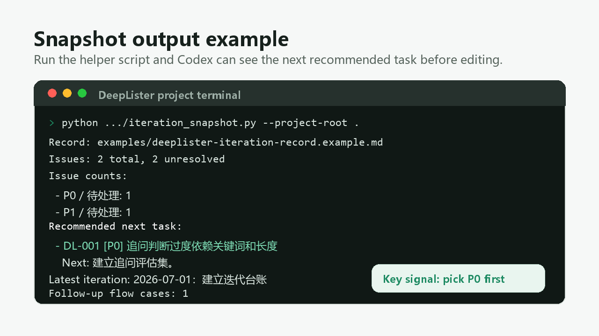

# deeplister-iteration-skill

一个给 Codex 使用的轻量迭代管理 skill。它适合第一次做大项目的小白：任务很多、很杂、很乱，不知道下一步该先做什么。这个 skill 帮 Codex 在做 DeepLister 项目时，快速找到下一步任务，并在每次迭代后更新 `docs/迭代记录.md`。

它不是项目管理平台，也不是自动开发工具。它更像一个很小的“迭代习惯插件”：提醒 Codex 先看问题池、优先处理高风险任务、完成后把变更和验证写回文档。

如果这个小工具对你有帮助，欢迎点个 Star。小项目也需要一点星光。

## 快速开始

1. 把 `deeplister-iteration/` 文件夹复制到你的 Codex skills 目录。
2. 重启 Codex 或新开一个会话，让 Codex 重新发现这个 skill。
3. 在你的 DeepLister 项目里准备 `docs/迭代记录.md`。如果还没有，可以先参考 [`examples/deeplister-iteration-record.example.md`](examples/deeplister-iteration-record.example.md)。
4. 对 Codex 说：

```text
Use $deeplister-iteration to pick the next DeepLister task.
```

中文也可以：

```text
用 deeplister-iteration 看一下下一步该做什么，并在做完后更新迭代记录。
```

如果想先确认文档能不能被脚本读到，可以在 DeepLister 项目根目录运行：

```powershell
python "$env:USERPROFILE\.codex\skills\deeplister-iteration\scripts\iteration_snapshot.py" --project-root .
```

你应该看到问题数量、未解决数量、推荐下一步任务和最近一次迭代记录。

运行结果大概长这样：



## 它解决什么问题

在一个产品原型持续迭代时，很多重要信息会散在聊天记录、README、临时笔记和代码改动里。时间一久，下一步该做什么就会变模糊。

这个 skill 解决的是：

- 让 Codex 每次迭代前先看统一的任务池。
- 优先处理 `P0` 级别的追问质量、隐私、安全、产品信任问题。
- 每次改完后自动补充迭代记录。
- 用脚本快速提取“推荐下一步任务”，减少反复读取长文档带来的 token 消耗。
- 把追问流程相关问题单独沉淀，方便持续优化核心体验。

## 适合谁用

- 正在用 Codex 做个人项目或产品原型的人。
- 第一次做大项目、容易被任务数量和复杂度压住的新手。
- 希望用一个 Markdown 文件管理迭代，而不是一上来就用 Notion、Jira 或 GitHub Projects 的人。
- 项目还在早期，但已经开始需要记录问题、决策、优先级和下一步方向的人。
- 想给自己的 Codex 做一个项目专属工作流的人。

## 不适合什么情况

- 多人协作已经很成熟，应该直接用 GitHub Issues、Linear、Jira 或 Notion 数据库。
- 需要权限、分派、截止日期、燃尽图等完整项目管理能力。
- 项目不是 Markdown 文档驱动，或者没有固定的迭代记录文件。

## 目录结构

```text
deeplister-iteration-skill/
  .github/
    ISSUE_TEMPLATE/
      bug_report.yml
      feature_request.yml
      installation_problem.yml
      use_case_feedback.yml
  assets/
    snapshot-output.png
    social-preview.png
  deeplister-iteration/
    SKILL.md
    agents/
      openai.yaml
    references/
      iteration-record-format.md
    scripts/
      iteration_snapshot.py
  examples/
    deeplister-iteration-record.example.md
  CHANGELOG.md
  README.md
  ROADMAP.md
  LICENSE
```

## 安装

把 `deeplister-iteration/` 文件夹放到你的 Codex skills 目录里。

Windows 默认位置通常是：

```text
C:\Users\<你的用户名>\.codex\skills\deeplister-iteration
```

macOS / Linux 默认位置通常是：

```text
~/.codex/skills/deeplister-iteration
```

安装后，重启 Codex 或重新开启会话，让 Codex 重新发现这个 skill。

如果 Codex 没识别到 skill、脚本跑不起来，先看 [`docs/INSTALLATION_TROUBLESHOOTING.md`](docs/INSTALLATION_TROUBLESHOOTING.md)。

## 使用方式

在 DeepLister 项目里，对 Codex 说：

```text
Use $deeplister-iteration to pick the next DeepLister task.
```

或者中文也可以：

```text
用 deeplister-iteration 看一下下一步该做什么，并在做完后更新迭代记录。
```

如果你只想看当前任务快照，可以在 DeepLister 项目根目录运行：

```powershell
python "$env:USERPROFILE\.codex\skills\deeplister-iteration\scripts\iteration_snapshot.py" --project-root .
```

输出会包含：

- 问题总数和未解决数量。
- 按优先级和状态统计的问题数量。
- 推荐下一步任务。
- 最近一次迭代记录标题。
- 追问流程专项案例数量。

## 期望的迭代记录格式

默认读取：

```text
docs/迭代记录.md
```

建议包含这些章节：

```md
# DeepLister 迭代记录

## 怎么使用
## 当前产品状态
## 当前优先级
## 问题池
## 追问流程专项记录
## 迭代记录
## 何时进阶
## 每次迭代记录模板
```

可以参考 [`examples/deeplister-iteration-record.example.md`](examples/deeplister-iteration-record.example.md)。

## 普通 prompt 和 skill 的区别

普通 prompt 更像“每次临时交代一遍”：你要告诉 Codex 去哪里看任务、怎么判断优先级、做完后怎么记录。时间久了，很容易漏步骤。

这个 skill 更像“把固定工作流写成规则”：Codex 每次被调用时都会先看迭代记录和问题池，再按优先级选任务，最后提醒自己把结果写回文档。

用产品经理的话说，它不是在做更强的项目管理系统，而是在解决一个更小、更高频的问题：让早期项目每次迭代都有一个清楚的下一步。

## 反馈与路线图

如果你试用时遇到问题，欢迎开 Issue：

- 安装失败或 Codex 识别不到 skill：使用 `Installation problem` 模板。
- 脚本或推荐结果看起来不对：使用 `Bug report` 模板。
- 想要新能力：使用 `Feature request` 模板。
- 想分享真实使用体验：使用 `User story / use case` 模板。

项目节奏可以看 [`ROADMAP.md`](ROADMAP.md)，每次重要变化会记录在 [`CHANGELOG.md`](CHANGELOG.md)。

如果你想快速了解一次完整使用流程，可以看 [`docs/DEMO_SCRIPT.md`](docs/DEMO_SCRIPT.md)。它是 60 秒 demo 的分镜和旁白草稿。

## 设计原则

- **轻量优先**：早期项目先用一个 Markdown 文档，不急着上复杂系统。
- **文档是事实来源**：skill 不保存完整项目历史，只告诉 Codex 怎么读和怎么更新。
- **优先级明确**：默认先处理 `P0`，尤其是追问质量、隐私、安全和用户信任问题。
- **每次迭代都留痕**：改了什么、为什么改、怎么验证、下次做什么，都要留下来。
- **少耗 token**：先跑脚本拿摘要，再按需读具体章节。

## 当前限制

- 目前主要面向 DeepLister 这种“本地 Markdown 迭代记录”的项目。
- 脚本只解析常见 Markdown 表格，不支持复杂嵌套格式。
- 它不会自动创建 GitHub Issues，也不会同步 Notion。
- 它不能代替真实测试、代码审查和产品判断。

## 后续方向

后续计划会持续更新在 [`ROADMAP.md`](ROADMAP.md)。当前最重要的是让新用户能看懂、装上、跑通，并愿意反馈真实问题。

## English

`deeplister-iteration-skill` is a lightweight Codex skill for keeping DeepLister iterations organized. It is especially useful for beginners working on their first larger project, where the task list feels long, messy, and hard to prioritize. It helps Codex choose the next task from a local Markdown issue pool and update `docs/迭代记录.md` after each meaningful change.

It is not a project management platform. Think of it as a small workflow guardrail: check the issue pool first, prefer high-risk product tasks, verify the change, and write the result back to the iteration record.

If this project helps you, a GitHub Star would be appreciated.

## Quick Start

1. Copy the `deeplister-iteration/` folder into your Codex skills directory.
2. Restart Codex or start a new session so the skill can be discovered.
3. Make sure your DeepLister project has `docs/迭代记录.md`. You can start from [`examples/deeplister-iteration-record.example.md`](examples/deeplister-iteration-record.example.md).
4. Ask Codex:

```text
Use $deeplister-iteration to pick the next DeepLister task.
```

To check whether the record can be read, run this from the DeepLister project root:

```powershell
python "$env:USERPROFILE\.codex\skills\deeplister-iteration\scripts\iteration_snapshot.py" --project-root .
```

You should see issue counts, unresolved counts, the recommended next task, and the latest iteration entry.

Example output:


## What It Solves

Early product projects often scatter important context across chat history, README files, notes, and code diffs. After a few iterations, it becomes hard to answer a simple question: what should we do next?

This skill helps Codex:

- Read a single local iteration record before starting work.
- Prefer `P0` tasks around follow-up quality, privacy, safety, and product trust.
- Update the iteration log after the work is done.
- Use a small snapshot script to reduce token-heavy document reading.
- Keep follow-up-question findings in one place.

## Who It Is For

- People building personal projects or product prototypes with Codex.
- Beginners working on their first large project and feeling overwhelmed by scattered tasks.
- Projects that want a simple Markdown workflow before adopting Notion, Jira, Linear, or GitHub Projects.
- Early-stage apps that need issue tracking, decisions, priorities, and next-step notes.
- Anyone creating a project-specific Codex workflow.

## Installation

Copy the `deeplister-iteration/` folder into your Codex skills directory.

Windows:

```text
C:\Users\<your-user>\.codex\skills\deeplister-iteration
```

macOS / Linux:

```text
~/.codex/skills/deeplister-iteration
```

Restart Codex or start a new session so the skill can be discovered.

If Codex cannot discover the skill or the script does not run, see [`docs/INSTALLATION_TROUBLESHOOTING.md`](docs/INSTALLATION_TROUBLESHOOTING.md).

## Usage

Inside a DeepLister project, ask Codex:

```text
Use $deeplister-iteration to pick the next DeepLister task.
```

To inspect the current iteration record manually:

```powershell
python "$env:USERPROFILE\.codex\skills\deeplister-iteration\scripts\iteration_snapshot.py" --project-root .
```

The script prints:

- Total and unresolved issue counts.
- Counts by priority and status.
- The recommended next task.
- The latest iteration entry.
- The number of follow-up-flow cases.

## Expected Record Format

By default, the skill reads:

```text
docs/迭代记录.md
```

See [`examples/deeplister-iteration-record.example.md`](examples/deeplister-iteration-record.example.md) for a complete example.

## Prompt vs Skill

A normal prompt is a one-off instruction: you explain where Codex should look, how it should prioritize work, and how it should update the log.

This skill turns that repeated workflow into a reusable rule. It asks Codex to check the iteration record, pick from the issue pool, respect priority, and write back what changed.

## Feedback and Roadmap

Use the GitHub Issue templates for installation problems, bugs, feature requests, or real use-case feedback.

See [`ROADMAP.md`](ROADMAP.md) for planned work and [`CHANGELOG.md`](CHANGELOG.md) for notable changes.

See [`docs/DEMO_SCRIPT.md`](docs/DEMO_SCRIPT.md) for a 60-second first-run demo script.

## Design Principles

- **Keep it lightweight**: one Markdown file is enough for an early project.
- **Use the document as the source of truth**: the skill stores workflow rules, not project history.
- **Respect priority**: handle `P0` product-risk tasks first unless there is a clear reason not to.
- **Record every iteration**: goal, decisions, completed work, verification, remaining work, and next recommendation.
- **Save tokens**: use the snapshot script before reading long sections.

## Limitations

- Designed around DeepLister-style local Markdown records.
- Parses simple Markdown tables only.
- Does not sync to GitHub Issues, Notion, Jira, or Linear.
- Does not replace tests, code review, or product judgment.

## License

MIT
