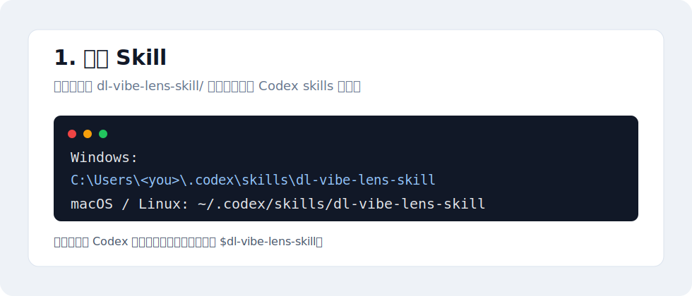
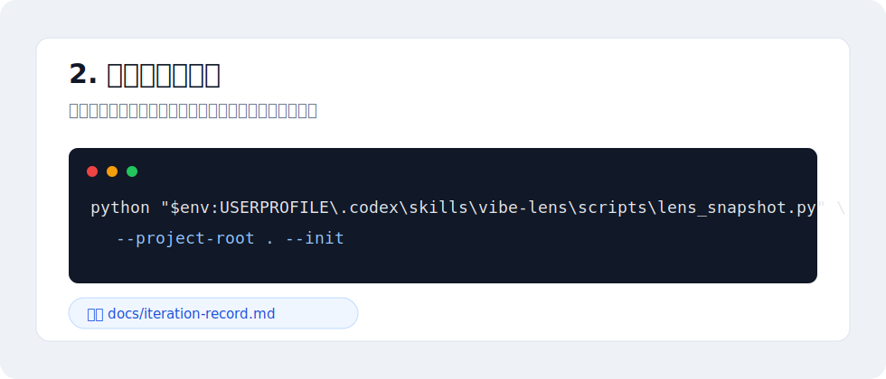
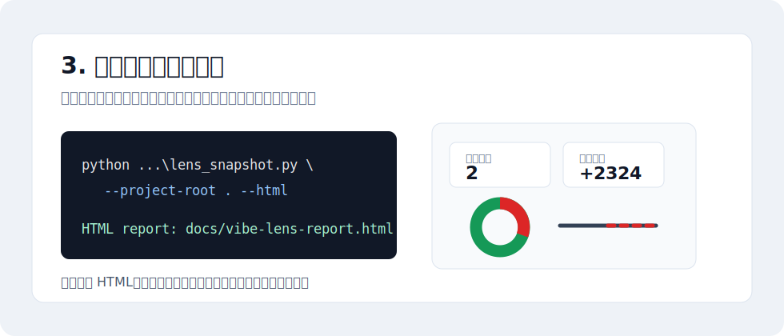

# DL-vibe-lens-skill

一个给 Codex 用的 Vibe Coding 复盘沙盘 Skill。

当 vibe coding 项目进入中后期，问题会散在聊天、文档、代码 diff 和半成品想法里；如果同时开多个 AI coding 对话，还可能出现文件重叠、方向不一致、上下文互相打架。`DL-vibe-lens-skill` 做的事很克制：把这些信息展示出来，让操作者和 Agent 看清局面。

`DL` 来自 DeepLister：这个想法最早是在 DeepLister 项目推进到中后期、问题开始堆叠时长出来的。保留 `DL`，既是来源标记，也方便记忆和调取。

`Vibe Lens` 顾名思义，就是给 vibe coding 过程装上一枚复盘镜头。它不替你驾驶项目，而是把当前问题、历史问题、代码差异、证据和迭代路径聚焦出来，让人和 Agent 都能看清“现在局面长什么样”。



## 它解决什么问题

- 当前有哪些问题还没处理清楚？
- 过去提过哪些问题，哪些已经解决？
- 这轮到底改了多少代码，新增和删除分别是多少？
- 项目迭代方向有没有发生转向？
- 结论有没有证据，验证过没有？
- 多个 AI 对话是否碰到了相同文件或区域？

它不是项目经理，不替你排优先级，也不默认安排任务。它的答案不是“你下一步必须做什么”，而是“现在局面长什么样”。

## 3 步开始用

### 1. 安装 Skill

把仓库里的 `dl-vibe-lens-skill/` 文件夹复制到 Codex skills 目录：

```text
C:\Users\<your-user>\.codex\skills\dl-vibe-lens-skill
```

macOS / Linux:

```text
~/.codex/skills/dl-vibe-lens-skill
```

复制后重启 Codex，或新开一个对话，让 Codex 发现 `$dl-vibe-lens-skill`。

### 2. 初始化记录文件

第一次使用不要手动建文件，直接运行：



```powershell
python "$env:USERPROFILE\.codex\skills\dl-vibe-lens-skill\scripts\lens_snapshot.py" --project-root . --init
```

这会生成两个文件：

```text
docs/iteration-record.md
docs/vibe-lens-settings.json
```

`docs/iteration-record.md` 是数据源，里面会写当前问题、活跃工作、证据和迭代记录。不要改掉这些二级标题：

```md
## 问题池
## 当前工作
## 追问流程专项记录
## 迭代记录
```

你可以改里面的内容、增删行、加新章节，但不要把这几个标题改名，也不要把问题池表格搬到脚本读不到的位置。

### 3. 生成复盘沙盘



命令行查看：

```powershell
python "$env:USERPROFILE\.codex\skills\dl-vibe-lens-skill\scripts\lens_snapshot.py" --project-root .
```

生成 HTML 可视化报告：

```powershell
python "$env:USERPROFILE\.codex\skills\dl-vibe-lens-skill\scripts\lens_snapshot.py" --project-root . --html
```

默认输出：

```text
docs/vibe-lens-report.html
```

也可以直接让 Codex 调用：

```text
Use $dl-vibe-lens-skill to initialize or inspect this project, generate the visual sandbox, and show questions, Git diff, evidence, conflict signals, and iteration path without ranking tasks.
```

## HTML 报告能看什么

- `总览数据`：当前问题、历史问题、变更文件、代码变化。
- `当前问题 / 任务`：当前仍需要看见的问题；超过三条时，列表内部滚动，不撑大主页。
- `代码差异`：左侧圆环展示新增/删除比例，右侧彩色数字展示新增行、删除行、变更文件数，文件列表内部滚动。
- `沙盘演示`：用更像复盘的方式，把问题、证据、代码变化、缺口放在一起。
- `证据链 / 冲突线索`：展示结论来源，以及多个会话是否碰到同一文件区域。
- `迭代路径`：主页只看大阶段；详情页可以展开关键节点。
- `中英文切换`：报告默认中文，可切换英文。
- `对话入口设置`：展示 `reply_entry_mode` 的三种模式：每轮显示、使用时显示、关闭。真正持续生效以 `docs/vibe-lens-settings.json` 或用户提示词为准。

代码差异来自 Git，不是 AI 猜的。脚本会读取：

```powershell
git diff --numstat
git diff --name-status
git status --short
```

## 对话末尾入口

项目启用后，默认设置是：

```json
{
  "reply_entry_mode": "always",
  "record_language": "auto"
}
```

这表示 Agent 在每轮回复末尾追加一个简约入口，例如：

```md
[⌕ Vibe Lens](http://127.0.0.1:<port>/docs/vibe-lens-report.html)
```

如果本轮不想显示，可以直接说“本轮不要显示 Vibe Lens 入口”。如果以后都不想显示，可以把 `reply_entry_mode` 改成 `"off"`。

## 项目边界

`DL-vibe-lens-skill` 不做这些事：

- 不自动给任务排优先级。
- 不给任务加权重。
- 不告诉操作者“必须先做哪个”。
- 不替代测试、代码审查、Jira、Linear、Notion。
- 不把 Markdown 记录当成最终产品界面；HTML 报告才是第一阶段展示面。

如果用户明确让 Agent 给建议，Agent 可以给判断，但必须把“事实展示”和“Agent 判断”分开说。

## 项目结构

```text
DL-vibe-lens-skill/
  dl-vibe-lens-skill/
    SKILL.md
    agents/openai.yaml
    assets/report_template.html
    references/lens-record-format.md
    scripts/lens_snapshot.py
  docs/
    iteration-record.md
    vibe-lens-settings.json
  examples/
    vibe-lens-record.example.md
  tests/
    test_lens_snapshot.py
```

这个仓库自己也在使用 Vibe Lens，数据源就是 [docs/iteration-record.md](docs/iteration-record.md)。

## 后续优化方向

- 详细迭代路径图：关键节点可展开/关闭，总控开关控制全部展开、全部收起、只看主线、显示放弃路径。
- 更完整的沙盘演示页：展示问题、证据、代码变化、路径转向之间的关系。
- 第二阶段平台：允许操作者在平台上编排问题/任务；Agent 可以只给冲突判断和编排建议，但不能把建议伪装成事实。
- GitHub Issues / PR 集成。
- Notion、Airtable 或其他记录系统导入。

## 验证命令

```powershell
python -m unittest tests.test_lens_snapshot
python -m py_compile dl-vibe-lens-skill\scripts\lens_snapshot.py
python dl-vibe-lens-skill\scripts\lens_snapshot.py --project-root . --record examples\vibe-lens-record.example.md
python dl-vibe-lens-skill\scripts\lens_snapshot.py --project-root . --html --output docs\vibe-lens-report.html
python dl-vibe-lens-skill\scripts\lens_snapshot.py --project-root .
```

## 许可证

MIT
