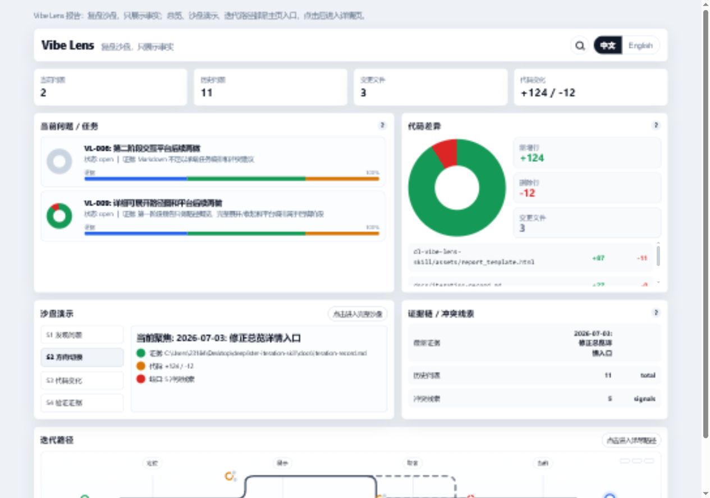
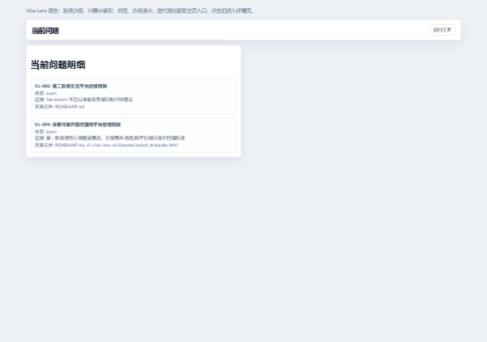
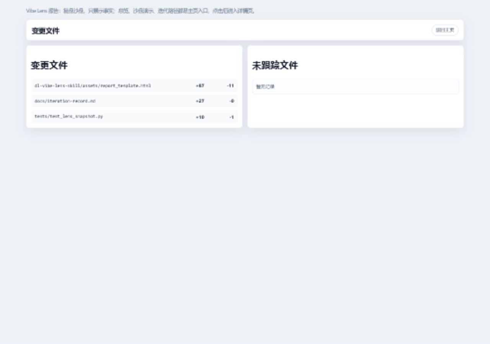
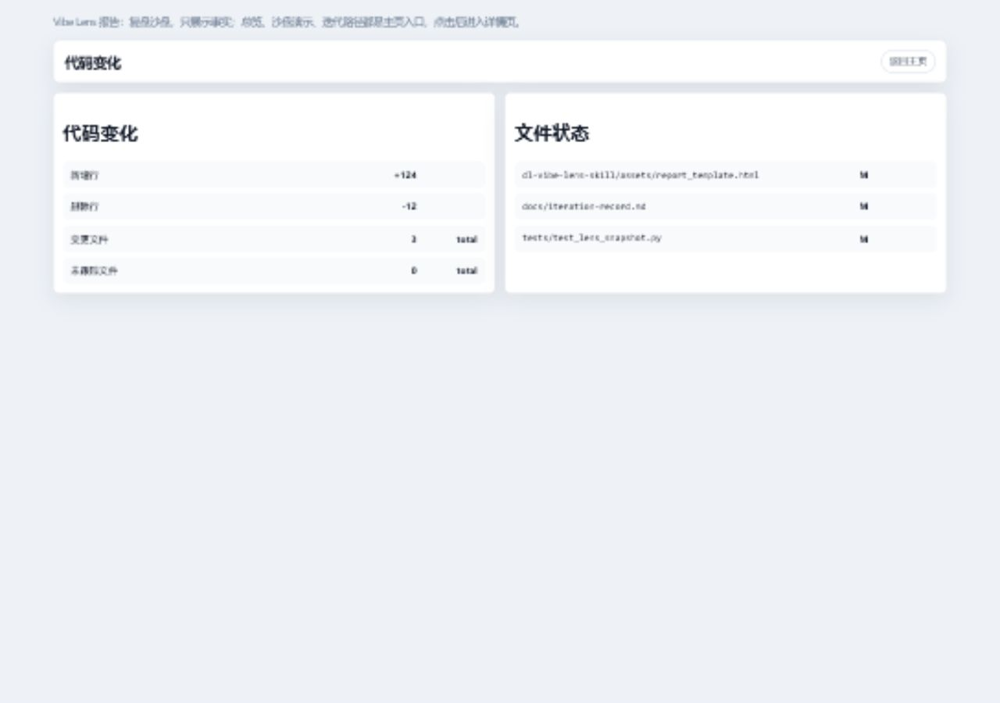
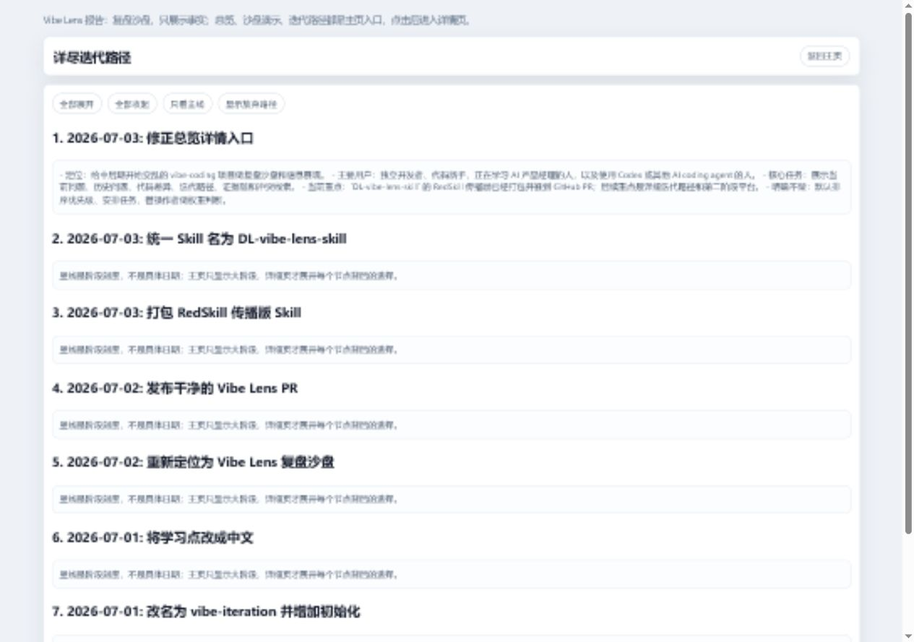
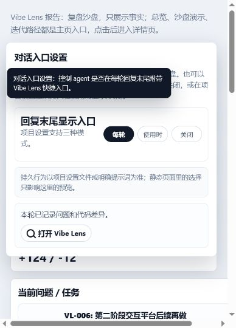

# DL-vibe-lens-skill 功能介绍

`DL-vibe-lens-skill` 是一个给 vibe coding 项目使用的复盘沙盘 Skill。

它的定位很克制：不替操作者排序、不安排任务、不擅自加权重，只把当前问题、历史问题、代码变化、证据链、冲突线索和迭代路径展示出来，让操作者和 Agent 自己判断下一步。

`DL` 来自 DeepLister，表示这个想法最早是在 DeepLister 项目推进到中后期、问题开始堆叠时长出来的。`Vibe Lens` 可以理解成给 vibe coding 过程装上一枚复盘镜头：它把散落在聊天、文档、代码 diff 和半成品想法里的信息重新聚焦。

## 适合谁

- 正在用 Codex 或其他 AI coding agent 做项目的人。
- 项目进入中后期，问题和想法开始变多的人。
- 同时开了多个 AI 对话，担心上下文打架或文件冲突的人。
- 代码新手、独立开发者、正在训练 AI 产品经理思维的人。

## 首页总览

首页只放复盘需要第一眼看到的内容：当前问题、历史问题、变更文件、代码变化、当前问题列表、代码差异、沙盘演示、证据链/冲突线索和迭代路径入口。



这块设计的产品逻辑是：让用户先看到局面，而不是先被要求做选择。总览里的四个指标都可以点击，分别进入对应详情页。

## 当前问题

当前问题页只展示还需要被看见的问题，不负责判断优先级。



主页里的当前问题卡片会固定高度；如果问题超过三条，列表内部滚动，不会把整个主页撑变形。每个条目可以展示证据完整度和关联代码变化，让问题不是孤立文字。

## 变更文件

变更文件页把这一轮涉及到的文件单独列出来，方便操作者确认“这轮到底碰了哪里”。



这个功能适合排查多个 Agent 同时工作时是否碰到了同一块区域。它只是给出信号，不自动判定冲突，也不强行安排任务。

## 代码变化

代码变化页读取 Git 数据，展示新增行、删除行和变更文件数。



这里的数据不是 AI 猜的，而是来自 Git：

```powershell
git diff --numstat
git diff --name-status
git status --short
```

所以它适合作为复盘证据：你能看到这轮变化是偏新增、偏删除，还是主要集中在少量文件里。圆环用于看比例，数字区域用于看具体值，文件列表用于回到代码层面。

## 迭代路径

迭代路径页展示项目方向变化。主页只保留简洁入口，详细页再展开阶段。



当前第一阶段展示的是大阶段和关键记录。后续版本可以继续做成可展开/收起的详细路径图：大问题下面展开选择、放弃、重来、验证等节点。

## 对话入口设置

项目启用后，可以让 Agent 在每轮回复末尾追加一个简约入口，方便随时打开复盘沙盘。



默认设置写在：

```text
docs/vibe-lens-settings.json
```

当前推荐默认值：

```json
{
  "reply_entry_mode": "always",
  "record_language": "auto"
}
```

`reply_entry_mode` 有三种模式：

- `always`：每轮回复末尾显示简约入口。
- `when_used`：只有本轮使用了 Vibe Lens 才显示入口。
- `off`：不显示入口。

入口应该是简约链接，而不是长 URL。例如：

```md
[⌕ Vibe Lens](http://127.0.0.1:60964/docs/vibe-lens-report.html)
```

如果操作者临时不想显示，可以直接对 Agent 说：“本轮不要显示 Vibe Lens 入口”。

## 第一次使用

第一次使用不需要手动创建记录文件。进入项目根目录后运行：

```powershell
python "$env:USERPROFILE\.codex\skills\dl-vibe-lens-skill\scripts\lens_snapshot.py" --project-root . --init
```

它会生成：

```text
docs/iteration-record.md
docs/vibe-lens-settings.json
```

之后生成 HTML 报告：

```powershell
python "$env:USERPROFILE\.codex\skills\dl-vibe-lens-skill\scripts\lens_snapshot.py" --project-root . --html
```

默认输出：

```text
docs/vibe-lens-report.html
```

## RedSkill 上传材料

推荐标题：

```text
DL-vibe-lens-skill
```

一句话简介：

```text
给 vibe coding 项目用的复盘沙盘：展示当前问题、历史问题、代码差异、证据链、冲突线索和迭代路径，不替你排序，不擅自安排任务。
```

推荐标签：

```text
AI编程, Codex, Vibe Coding, 项目复盘, 产品经理, Git Diff, Skill
```

推荐封面/配图：

```text
assets/feature-01-home.png
assets/feature-04-code-detail.png
assets/feature-05-path-detail.png
assets/feature-06-entry-settings.png
```

推荐正文：

```text
DL-vibe-lens-skill 是一个给 vibe coding 项目用的复盘沙盘 Skill。

它不替你排优先级，也不擅自安排任务，而是把当前问题、历史问题、代码差异、证据链、冲突线索和迭代路径展示出来。

适合项目进入中后期、问题开始堆叠、同时开多个 AI coding 对话、需要复盘和看清局面的时候使用。

第一次使用可以自动初始化记录文件，不需要手动搭 Markdown。生成 HTML 后，可以用一个简约入口随时打开复盘沙盘。
```

## RedSkill 上传步骤

1. 先确认本地已经生成上传包：

```text
dist/redskill/DL-vibe-lens-skill-redskill.zip
```

2. 打开 RedSkill 的上传/投稿页面。

3. 上传这个 zip 包。如果平台要求上传文件夹，就上传解压后的：

```text
dist/redskill/DL-vibe-lens-skill
```

4. 标题填写：

```text
DL-vibe-lens-skill
```

5. 简介填写上面的“一句话简介”。

6. 详情正文可以复制“推荐正文”，也可以把本文件作为长介绍参考。

7. 配图选择 `assets/feature-*.png` 这组功能界面图。

8. 发布前检查压缩包根目录里能看到：

```text
SKILL.md
agents/
assets/
references/
scripts/
```

不要把 `__pycache__`、测试缓存、临时 HTML 报告、`.git` 目录放进上传包。

## 目前边界

- 第一阶段是 HTML 复盘展示，不是完整任务编排平台。
- 迭代路径目前展示大阶段；可展开/收起的详细路径图属于后续版本。
- Agent 可以基于事实给建议，但必须明确标注“这是判断”，不能把判断伪装成记录事实。
