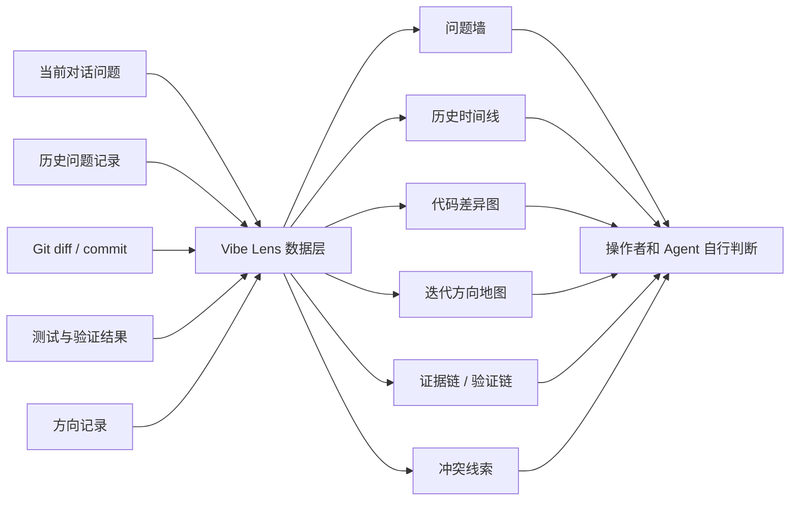

# vibe-lens 产品设计草案

日期：2026-07-02

## 一句话定位

`vibe-lens` 是一个给 vibe coding 项目用的复盘沙盘。它把当前问题、历史问题、代码差异、迭代方向和验证证据可视化展示出来，帮助操作者和 Agent 看清局面，但不替他们做优先级判断，也不默认安排任务顺序。

中文大白话：它不是项目经理，也不是任务裁判。它像一个项目仪表盘，把“现在发生了什么、过去发生了什么、代码变了哪里、方向怎么走、证据是什么”摆出来。

## 需要纠正的旧定位

当前 `vibe-iteration` 仍然带有这些旧假设：

- 读取问题池后选择最高优先级任务。
- 通过 `P0`、`P1`、`P2`、`P3` 默认影响下一步行动。
- 用 Markdown 记录承担太多职责。
- 把“减少冲突”和“安排任务”混在一起。

新定位要改成：

- 只展示事实、关系、变化和证据。
- 不给问题自动加权。
- 不替操作者判断什么最重要。
- 不默认输出“下一步应该做什么”。
- 允许 Agent 基于沙盘信息、项目语境和操作者想法自己判断。

## 命名建议

推荐改名：

- Skill 名：`vibe-lens`
- 仓库名：`vibe-lens-skill`
- 展示平台名：`Vibe Lens`

理由：

- `lens` 表示透镜、观察器，强调看清楚，不强调管理。
- `iteration` 容易让人联想到迭代管理和优先级排序。
- `sandbox` 很贴近“沙盘”，但英文里也常表示代码运行沙箱，可能误导。

兼容策略：

- 保留旧 `vibe-iteration` 兼容说明一段时间。
- 旧的 `docs/iteration-record.md` 可继续作为输入源之一。
- 公开文档和新用户入口统一改到 `vibe-lens`。

## 第一阶段：复盘沙盘

第一阶段只做信息展现，不做任务编排。

### 需要展示的信息

1. 当前问题

展示 Agent 和操作者现在提出的问题，包括来源、时间、关联文件、当前状态。这里的“状态”只描述事实，例如 open、discussing、resolved、blocked，不代表优先级。

2. 历史问题

展示过去提出过的问题，按时间线、主题或文件区域查看。目标是帮助复盘“哪些问题反复出现”“哪些方向曾经被放弃或修正”。

3. 代码差异统计

展示为了解决问题而新增、删除、修改的代码。数据来自 Git，不靠 AI 猜。

可视化方式：

- 按文件展示新增/删除行数柱状图。
- 按目录展示代码变动热力图。
- 按迭代展示代码 churn 趋势。
- 展示问题到文件的关联：问题 -> 变更文件 -> 验证结果。

准确性说明：

- Git 可以通过 `git diff --stat`、`git diff --numstat`、`git log --numstat` 精确给出文本文件的增删行数。
- 准确性的关键不是 Codex 能不能算，而是要定义统计边界：从哪一次快照到哪一次快照、从哪个 commit 到哪个 commit、还是当前未提交改动。
- 对二进制文件、未跟踪文件、生成文件、重命名文件，需要单独标注，不能假装和普通代码一样精确。

4. 迭代方向

展示项目方向如何变化，不只写文字总结。

可视化方式：

- 方向时间线：每次重要迭代的目标和结果。
- 主题地图：问题聚类成 onboarding、展示平台、兼容、可视化、发布等主题。
- 决策流图：从问题出现到方向调整的路径。
- 方向漂移图：展示“原计划”和“实际推进”的差异。

5. 证据链和验证链

这是新增的第五类信息。复盘不只看做了什么，还要看为什么这么做、怎么证明它有效。

展示内容：

- 问题从哪里来：用户提出、Agent 发现、测试失败、代码阅读、外部参考。
- 为了解决问题看过哪些证据：文档、Git diff、测试输出、截图、外部项目。
- 做了哪些修改。
- 跑了哪些验证命令。
- 哪些结论仍然不确定。

### 可选但重要：冲突线索展示

第一阶段可以展示冲突线索，但不能给出编排结论。

例如：

- 两个会话是否触碰同一批文件。
- 一个问题是否依赖另一个问题尚未完成。
- 当前修改是否和历史方向相反。
- 多个问题是否都指向同一模块。

这些只作为“线索”，不输出“你必须先做 A 再做 B”。

## 第二阶段：平台化编排

第二阶段才进入任务和问题编排。

这一阶段可以做：

- 在平台上拖拽或组织问题。
- Agent 检查问题之间是否可能冲突。
- Agent 给出编排建议。
- 展示建议背后的证据。
- 让操作者确认或否决建议。

第二阶段必须保留一个边界：

- “事实展示”和“Agent 建议”要分层显示。
- Agent 建议不能伪装成事实。
- 所有建议都要能回溯到证据，例如文件重叠、依赖关系、失败测试、历史决策。

## 信息架构

## 技术形态

参考 `KKKKhazix/khazix-skills` 的 `storage-analyzer`，推荐采用“Skill + 脚本 + JSON + HTML 报告 + 可选本地服务”的结构。

### Skill 层

`SKILL.md` 只负责告诉 Agent 什么时候使用、如何采集、如何生成沙盘报告。

它不应该写成大产品说明书，也不应该内置复杂优先级规则。

### 数据采集脚本

脚本负责稳定采集：

- `docs/iteration-record.md` 或兼容旧记录。
- Git diff 统计。
- Git log 统计。
- 当前未提交变更。
- 验证命令记录。

输出结构化 JSON，供展示层使用。

### 展示层

展示层生成本地 HTML 报告。

第一版优先做静态 HTML，因为简单、可分享、可留存。

后续再加本地 server，用于：

- 交互筛选。
- 展开和折叠问题。
- 在文件管理器中打开关联文件。
- 第二阶段任务编排。

### Markdown 的角色

Markdown 不再是最终展示平台，只是输入源和低成本备份。

大白话：md 继续当“原始记录本”，但不再让用户只盯着 md 看。

## 结合现有 Skills 和插件的分工

项目自身要保持小而稳，不把所有能力塞进 Skill 本体。

可借鉴或调用的能力：

- `skill-creator` / `writing-skills`：约束 Skill 结构。
- `gstack-retro`：借鉴提交历史、趋势、复盘指标。
- `gstack-diagram`：生成方向图、流程图、关系图。
- `baoyu-infographic`：生成更适合传播的图像版复盘。
- `frontend-design` / `sketch` / `ui-ux-pro-max`：设计展示平台界面。
- `data-analytics` 插件：后续承接正式 dashboard。
- `github` 插件：后续同步 issue、PR、commit。
- `notion` / `airtable`：后续同步外部资料库。
- `firecrawl`：研究外部同类产品。

原则：这些是工具箱，不是产品边界。第一阶段仍然坚持“展示，不裁决”。

## 第一版展示页面结构

建议第一版页面顺序：

1. 项目概览

显示项目名、统计范围、生成时间、问题数量、代码变更总量、验证次数。

2. 当前问题墙

显示当前 Agent 和操作者提出的问题，不按优先级排序，可按来源、状态、文件区域筛选。

3. 历史问题时间线

展示过去问题的出现、变化、解决和遗留。

4. 代码差异可视化

展示新增/删除行数、变动文件、目录热力图、问题到文件的关联。

5. 迭代方向地图

展示方向变化，不只写文字。

6. 证据与验证链

展示每次重要修改背后的证据和验证结果。

7. 冲突线索

只展示可能冲突的文件、会话和假设，不给任务排序。

## 测试与验证

第一阶段需要验证：

- 缺少记录文件时，能自动初始化，而不是要求手动建文件。
- 旧 `docs/iteration-record.md` 能继续读取。
- Git diff 统计和 `git diff --numstat` 对得上。
- 生成的 JSON 有稳定 schema。
- HTML 报告可以直接打开。
- 页面上没有“推荐优先级”“下一步必须做什么”等越界表达。
- 中文说明对代码新手可读。

## 不做什么

第一阶段明确不做：

- 自动优先级排序。
- 自动任务编排。
- 自动分配负责人。
- 自动创建项目管理系统。
- 默认同步 Notion、Jira、Linear。
- 替代测试、代码审查或产品判断。

## 实施顺序建议

1. 改定位和命名：`vibe-iteration` -> `vibe-lens`。
2. 改 `SKILL.md`：删除任务选择规则，改成沙盘采集和展示流程。
3. 保留并调整初始化脚本：从“iteration snapshot”改成“lens snapshot”。
4. 增加 Git diff 统计输出。
5. 增加 JSON 输出。
6. 增加静态 HTML 报告模板。
7. 更新 README、ROADMAP、示例、测试。
8. 同步本地安装的 Skill。
9. 第二阶段再设计交互平台和编排建议。

